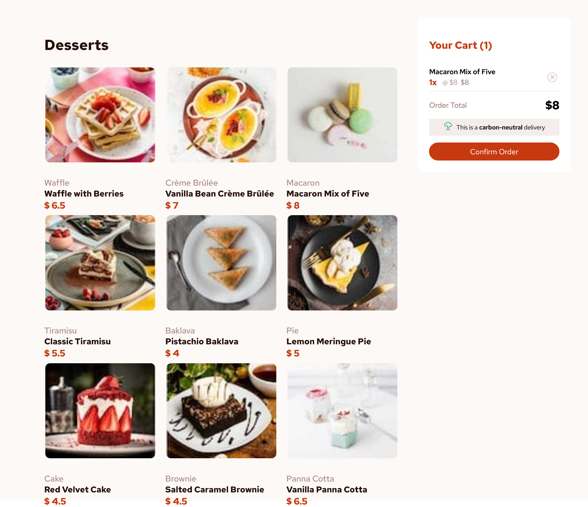

# Frontend Mentor - Product list with cart solution

This is a solution to the [Product list with cart challenge on Frontend Mentor](https://www.frontendmentor.io/challenges/product-list-with-cart-5MmqLVAp_d). Frontend Mentor challenges help you improve your coding skills by building realistic projects. 

## Table of contents

- [Overview](#overview)
  - [The challenge](#the-challenge)
  - [Screenshot](#screenshot)
  - [Links](#links)
- [My process](#my-process)
  - [Built with](#built-with)
  - [What I learned](#what-i-learned)
  - [Continued development](#continued-development)
- [Author](#author)

**Note: Delete this note and update the table of contents based on what sections you keep.**

## Overview

This challenge was actually a fun . i personally took my time to make should it looks similar. Building a project like this isn't really easy but till not hard

### The challenge

Users should be able to:

- Add items to the cart and remove them
- Increase/decrease the number of items in the cart
- See an order confirmation modal when they click "Confirm Order"
- Reset their selections when they click "Start New Order"
- View the optimal layout for the interface depending on their device's screen size
- See hover and focus states for all interactive elements on the page

### Screenshot



### Links

- Solution URL: [Add solution URL here](https://product-list-seven-tau.vercel.app)
- Live Site URL: [Add live site URL here](https://product-list-seven-tau.vercel.app)

## My process

so i started by structuring the ui, thats the user interface then i move to some functionality and with that i was able to complete the project

### Built with

- Semantic HTML5 markup
- CSS custom properties
- Flexbox
- Mobile-first workflow
- [React](https://reactjs.org/) - JS library


### What I learned

trying to achieve the hover effect with out css 

```html
<h1 onMouseEnter={()=>setOnHover(true)}>Add to Cart</h1>
```

### Continued development

i will love to focused more on the semantics markup and also javascript syntax


## Author

- Website - [Okoye Augustine](https://product-list-seven-tau.vercel.app)
- Frontend Mentor - [@Kenzkyi](https://www.frontendmentor.io/profile/Kenzkyi)
- Twitter - [@EkeneOkoye20](https://www.twitter.com/EkeneOkoye20)

